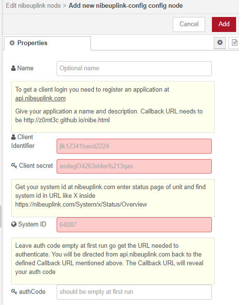
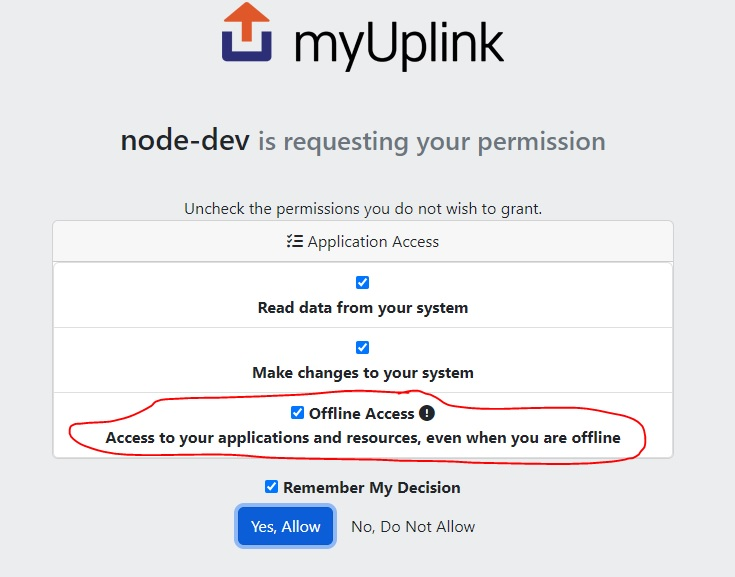

# node-red-contrib-myuplink
Node-Red Node for collecting data from myUplink.

During setup of config you will be guided on how to sign up for an API key to your own account. For an easy start import the example.

**How to import:**
Menu top right -> Import -> Examples -> node-red-contrib-myuplink -> basic

 The node

 The config

## List of supported functions

Documentation of functions are found here https://api.myuplink.com/swagger/index.html

# Help with app setup
For node-red access you need to register an app on you user profile at:
https://dev.myuplink.com/apps

Guide text inside node-red config setup should help you fill in any specific details needed.

## What is offline access
*This question might come to you when during the setup you are asked for the one time auth code. If you press the wrong button here, clear browser history and try again.*

**Remember to check the offline access checkmark after login to myUplink from the popup** Else you will need generate a new one time auth code every hour! I know the offline access statement seems worrisome but that just means that your auth codes can be refreshed without you needing to login and approve it each time/aka every hour.

