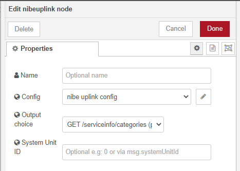

# node-red-contrib-nibeuplink
A Node-Red Node for collecting data from nibe uplink.

[](https://nodered.org)

***This node is in test phase!***




## To install

### Install in docker:
In terminal:
```bash
docker exec -it node-red /bin/bash
cd /data
npm install github:zinen/node-red-contrib-nibeuplink
```
